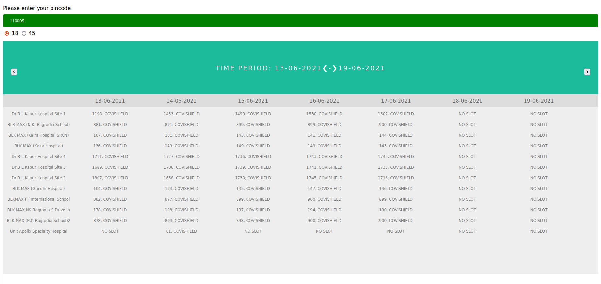

# Cowin-Vaccine-Appointment-Finder
A web-interface made using Cowin API to search for vaccine appointment for a given pincode using Python, Flask, jQuery and AJAX.

## Demo


## To run the app
To run the app follow these steps-
1) Clone the repository
2) Create a virtual environment and activate the same. 
  ```
  python3 -m venv cowinapp && source cowinapp/bin/activate
  ```
  Here, a virutal env named "cowinapp" has been created and activated
  
3) Install libraries using requirement.txt
  ```
  pip install -r requirements.txt
  ```
4) set variable FLASK_APP as main.py and run the flask application
  ```
  export FLASK_APP=main.py
  flask run
  ```

